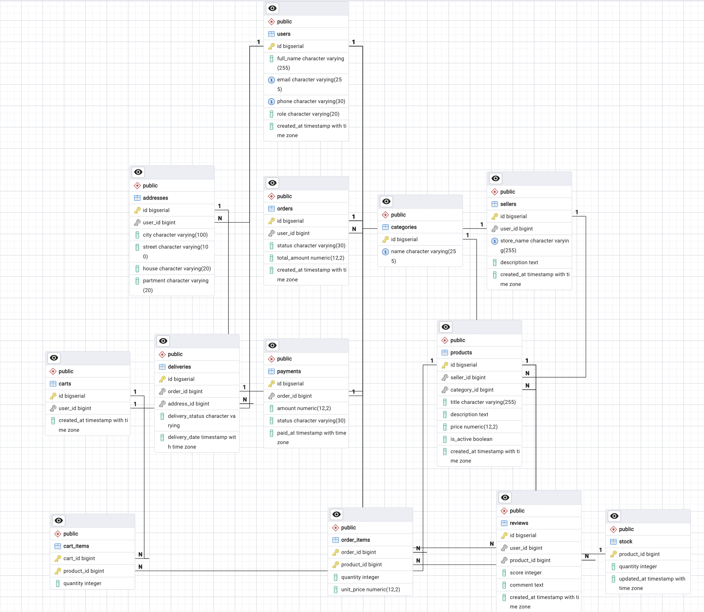

# Лабораторная работа №1. Проектирование базы данных маркетплейса

## Цель работы

Спроектировать реляционную базу данных для маркетплейса в 3НФ и реализовать её на PostgreSQL: таблицы, первичные и внешние ключи, ограничения целостности.

## Состав работы

* [`01_schema.sql`](./01_schema.sql) — DDL-скрипт создания схемы (таблицы, ключи, ограничения)
* [`erd_lab1.png`](./erd_lab1.png) — ER-диаграмма базы данных

## Проектирование

База данных включает 13 сущностей:

1. `users` — пользователи (покупатели)
2. `addresses` — адреса доставки пользователей
3. `sellers` — продавцы
4. `categories` — категории товаров
5. `products` — товары
6. `stock` — остатки товаров
7. `carts` — корзины (одна корзина на пользователя)
8. `cart_items` — позиции в корзине
9. `orders` — заказы
10. `order_items` — позиции заказа (с фиксацией цены `unit_price`)
11. `payments` — оплаты (один платёж на заказ)
12. `deliveries` — доставки (одна доставка на заказ)
13. `reviews` — отзывы пользователей о товарах

Ключевые связи:

* `users 1—N addresses`, `users 1—1 carts`, `users 1—N orders`, `users 1—N reviews`
* `sellers 1—N products`, `categories 1—N products`
* `products 1—1 stock`, `products 1—N cart_items / order_items / reviews`
* `carts 1—N cart_items`, `orders 1—N order_items`
* `orders 1—1 payments`, `orders 1—1 deliveries`

## ER-диаграмма



## Как запустить

```bash
psql -U postgres -d marketplace -f lab_1/01_schema.sql
```

Скрипт идемпотентен (`CREATE TABLE IF NOT EXISTS`), транзакционный (`BEGIN; ... COMMIT;`).

## Технологии

* **БД:** PostgreSQL 18.6
* **Инструменты:** pgAdmin 4
